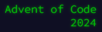

# Advent of Code 2024



[Advent of Code 2024](https://adventofcode.com/2024) solutions in C#.


## Installation

Requires

- [.NET 9](https://dotnet.microsoft.com/en-us/download/dotnet/9.0)
- [PowerShell](https://learn.microsoft.com/en-us/powershell/scripting/install/installing-powershell)

## Usage

### New Day

This will create the `IDay` file, the `*.txt` input file,
and the unit test file for a given day.

```powershell
./aoc.ps1 new 25
```

### Run

```powershell
./aoc.ps1 run
```

### Test
```powershell
./aoc.ps1 test
```
